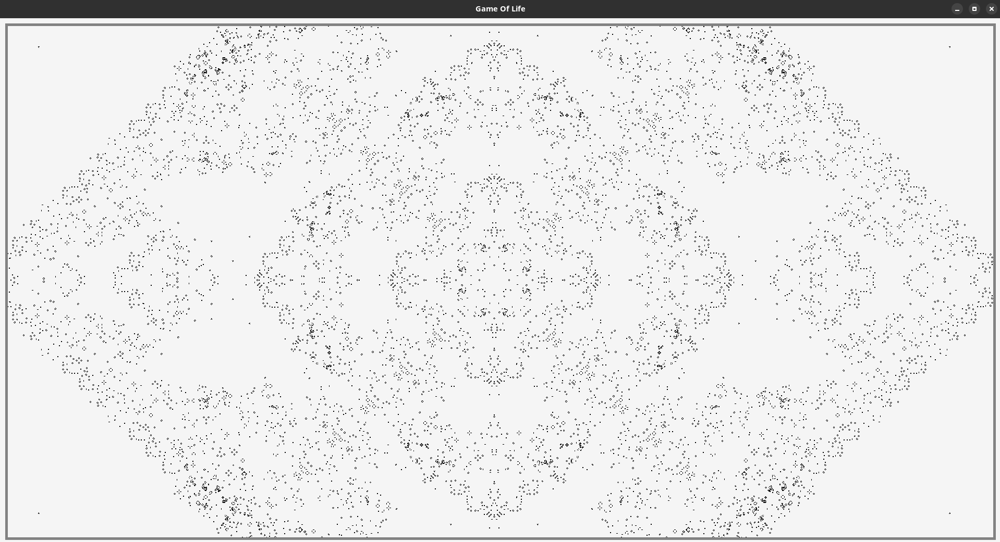

# GOL

A Game Of Life implementation in C using the amazing [raylib v5](https://github.com/raysan5/raylib)

## Todo

- Mapping for azerty keyboard
- Command Line tool to interract with gol
- Proper layout library (on top of raylib?)
  - Floating debug popup

Later:
- Shift+Click and drag to create/delete cells under cursor
